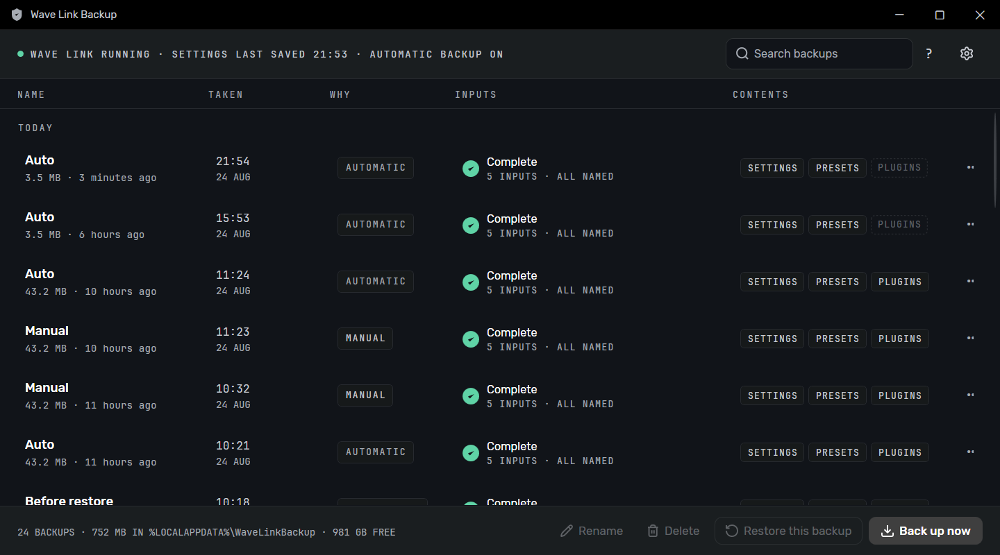
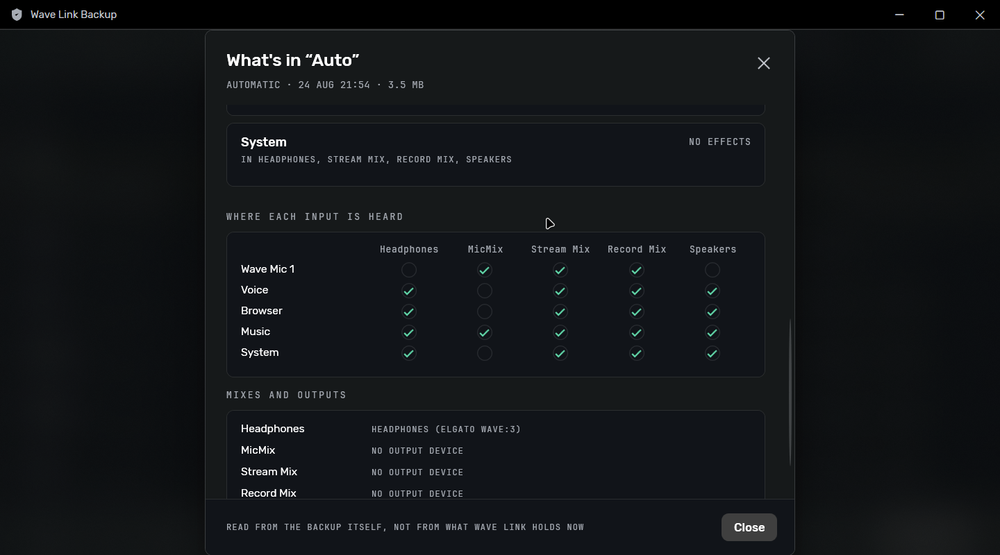
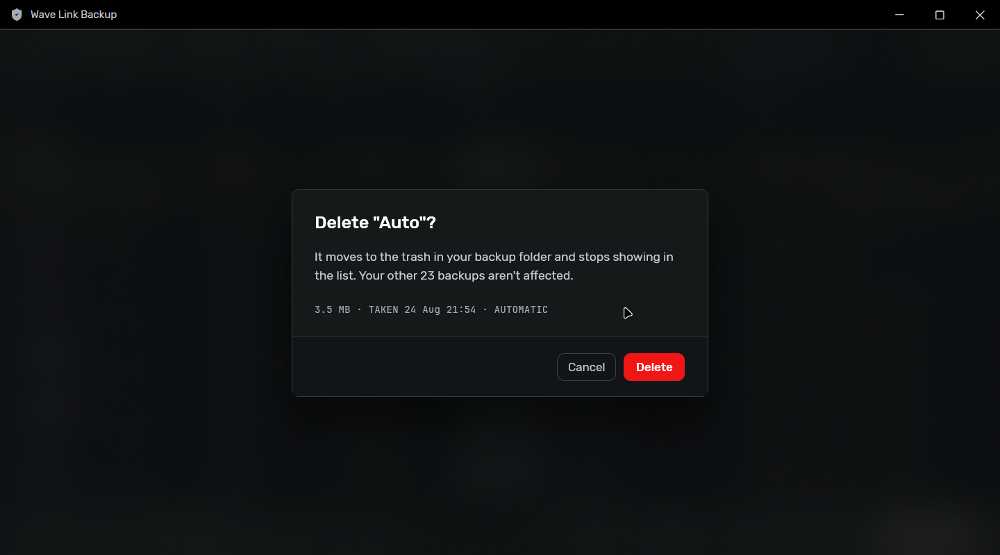
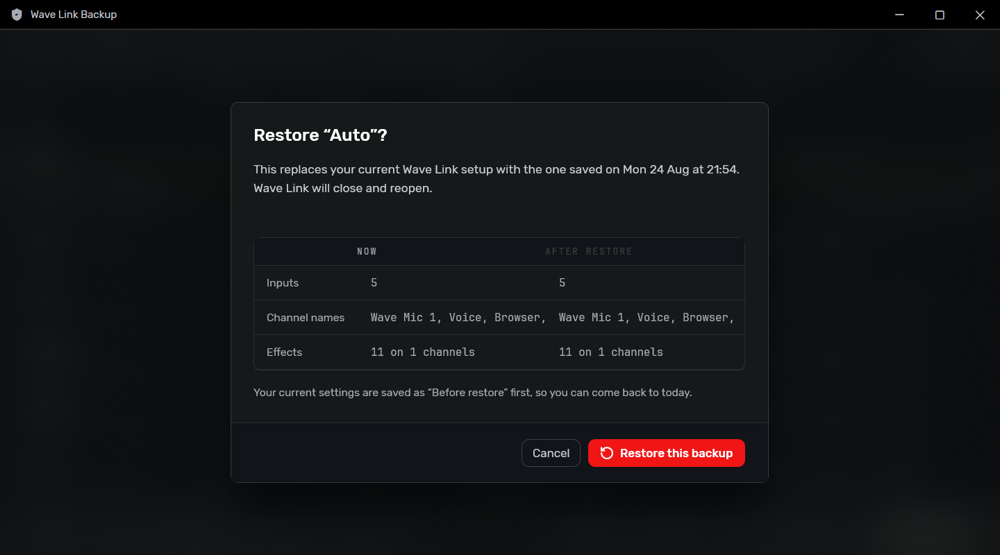

<h1 align="center">Wave Link Backup</h1>

<p align="center">
  Automatic backups for your Elgato Wave Link setup, and a way to see what is in them.
</p>

<p align="center">
  
</p>

Wave Link keeps its entire configuration in one small JSON file. It also keeps about three days
of its own backups, which is not much of a safety net if a chain breaks on a Friday and you
notice on Monday. This app keeps one snapshot per distinct configuration for as long as you want
them. A tray app takes them on your machine; there is a CLI if you would rather drive it
yourself.

<p align="center">
  <a href="#what-it-does">What it does</a> •
  <a href="#what-it-will-not-do">What it will not do</a> •
  <a href="#privacy">Privacy</a> •
  <a href="#screenshots">Screenshots</a> •
  <a href="#download">Download</a> •
  <a href="#cli">CLI</a> •
  <a href="#building">Building</a> •
  <a href="#architecture">Architecture</a> •
  <a href="#credits">Credits</a>
</p>

---

## What it does

### Backups

The app watches the settings file and waits for the write to settle before it copies anything.
You choose an interval between 15 minutes and 24 hours, and it keeps at most one copy per
interval. If nothing changed, nothing is written. There is an optional daily backup at a time you
pick, so a machine that sits idle still gets a known-good point.

Identical configurations are stored once. A corrupted snapshot will never push a good one out of
retention. Automatic backups are pruned to your count, 30 by default; backups you have named
yourself are not, and neither is the safety snapshot taken before a restore.

### Reading the history

Every snapshot describes itself, so you can see the inputs, channels and effect counts before you
restore rather than after. A collapsed configuration looks obviously different from a healthy one
in the list.

Deleting a backup moves it to a `.trash` folder inside your store. Emptying that trash is a
separate step, and where the volume supports it the files go to the Recycle Bin.

### Restoring

A snapshot is always taken first, automatically, which is what makes the one destructive button
safe to press.

If a plug-in referenced by the backup is missing, the app names it: *"FabFilter Pro-Q 3 isn't
installed on this computer"* rather than "an effect failed to load". Your effect presets, the EQ
curves and gate thresholds, come back with the settings, and that is on by default. Plug-in
binaries are opt-in (`--with-plugins`, and it needs admin) because a copied `.vst3` is not a
licence. When you do turn them on, only the plug-ins your setup actually references get captured.

### The tray app

It sits in the system tray with a live "last backup" readout. The menu will back up now, open the
store, pause for an hour, or quit, and the quit item tells you that quitting stops the backups.

Light, dark and high contrast are read from Windows, and you can override the choice. The accent
colour comes from your system accent. There are toggles for starting with Windows and for hiding
to the tray on close, plus a daily update check that tells you when a new version exists. The
check only ever looks. Nothing installs unless you ask for it.

---

## What it will not do

**Back up plug-in licences.** Copying a `.vst3` restores the code and not the authorisation.
Reinstall and re-authorise on a new machine, then restore.

**Move your setup to another computer.** A snapshot names the audio devices plugged into *this*
machine, so those channels are dead if you restore it elsewhere. Snapshots are machine-local and
the UI labels them that way.

**Send anything anywhere.** There is no upload to switch off, because there is no upload.

---

## Privacy

**Read this before you share a backup with anyone.** A Wave Link settings file contains hardware
serial numbers, buried inside the audio device IDs, and absolute paths that include your Windows
username. Don't attach raw snapshots to bug reports.

There is a redacting diagnostics report for that: **Copy diagnostics** in Settings, or `wlbackup
diagnostics`. It strips serials, usernames and snapshot display names, and it fails closed on any
shape it does not recognise. It never includes the settings file itself, redacted or otherwise.
The output goes to your clipboard or your terminal, and nowhere else.

---

## Screenshots

| Snapshot details | Delete confirmation | Restore preview |
|---|---|---|
|  |  |  |

---

## Download

Grab the latest release from
[GitHub Releases](https://github.com/F3NN3X/wavelink-backup-restore/releases):

| Asset | What it is |
|---|---|
| `WaveLinkBackup-*-app-win-x64.zip` | The tray app. Extract and run. Needs the [.NET 10 Desktop Runtime](https://dotnet.microsoft.com/download/dotnet/10.0). |
| `WaveLinkBackup-CLI-*-win-x64.zip` | The `wlbackup` CLI, a single file, framework-dependent or AOT. |

Every release ships a `.sha256` sidecar for each archive. The download is under 8 MB rather than
about 101 MB because the app does not carry the .NET runtime with it.

---

## CLI

Twelve verbs, machine-readable output with `--json`, and a distinct exit code per failure so
scripts can branch on it. The CLI reads the same settings file as the app. A flag overrides that
file for one run, never the other way around.

```powershell
wlbackup backup --name "Before 3.3 beta"    # take one now
wlbackup list                               # what you have
wlbackup restore <id>                       # shows what changes, then asks
wlbackup watch                              # back up on its own until Ctrl+C
wlbackup help                               # everything else
```

The rest: `rename`, `delete`, `empty-trash`, `verify`, `prune`, `diagnostics`, `version`.

---

## Building

Requires the .NET 10 SDK on Windows. The published app needs the
[.NET 10 Desktop Runtime](https://dotnet.microsoft.com/download/dotnet/10.0) at run time, which a
fresh machine won't have. That trade is deliberate: shipping the runtime would take the archive
from about 7.6 MB to 101 MB. It costs you a worse first-run failure, because a machine without
the runtime gets the stock .NET "framework not found" error instead of a friendly prompt. A WPF
app built this way fails before any of its own code runs, so there is nowhere to put the prompt.

```powershell
dotnet build WaveLinkBackup.slnx
dotnet test  WaveLinkBackup.slnx

# CLI: single file, resolves the runtime from the machine at startup
dotnet publish src/WaveLinkBackup.Cli -c Release                      # ~0.2 MB archive
dotnet publish src/WaveLinkBackup.Cli -c Release -p:PublishAot=true   # ~3 MB native (needs MSVC)

# App: the .NET 10 Desktop Runtime is a prerequisite, not a payload
dotnet publish src/WaveLinkBackup.App -c Release
```

The AOT build's link step calls `vswhere.exe` unqualified. If it fails with
`MSB3073 ... exited with code 123`, add
`%ProgramFiles(x86)%\Microsoft Visual Studio\Installer` to `PATH`.

A handful of tests read your real Wave Link configuration when one is installed and skip when it
isn't, so the suite is green either way. None of them write, close Wave Link, or touch your live
settings.

## Architecture

C# on .NET 10. A headless core library with two thin shells, which keeps the backup logic
testable and lets it run without a window.

```
src/WaveLinkBackup.Core     class library, and everything that can be pure is
  Analysis/                 validation, fingerprint, log parsing
  Discovery/ Io/ Process/   finding, reading and safely replacing settings
  Snapshots/ Restore/       the store, the guard, the restore sequence
  Automation/               watcher, debounce, dedup, retention
src/WaveLinkBackup.Cli      wlbackup: twelve verbs, scriptable, AOT-able
src/WaveLinkBackup.App      WPF tray app: list, details, settings, updates, help, about
third_party/                vendored upstream snapshot, excluded from the build
```

The reasoning is in [ADR-001](_docs/decisions/ADR-001-csharp-over-rust.md) (language),
[ADR-004](_docs/decisions/ADR-004-core-library-thin-shells.md) (this split) and
[ADR-005](_docs/decisions/ADR-005-wpf-for-the-gui.md) (the UI framework).

Working notes, decision records and the list of ways this goes wrong live in
[`_docs/`](_docs/index.md).

## Credits

Built on **[voltybat/WaveLinkSettingsUtility](https://github.com/voltybat/WaveLinkSettingsUtility)**
(MIT), which had already solved the parts that are tedious to get right: package discovery that
avoids the stale vendor folder, Core Audio endpoint enumeration, the shutdown sequence, and
atomic writes.

This fork adds what that tool deliberately leaves out, namely a watcher, a snapshot store with
retention, content-hash dedup, duplicate-key validation and a GUI. What was taken, what needed
fixing, and why forking beat contributing upstream is written up in
[the audit](_docs/audits/2026-08-15-voltybat-wavelinksettingsutility.md) and
[ADR-002](_docs/decisions/ADR-002-fork-wavelinksettingsutility.md).

---

<p align="center">
  <strong>Platform</strong> Windows 10 20H1+ (<code>net10.0-windows</code>) &middot; <a href="_docs/decisions/ADR-008-windows-only-scope.md">why Windows only</a><br>
  <strong>Status</strong> v0.7.6, tray app and CLI both working. In-app updates work from 0.7.6 onward; earlier builds have to be replaced by hand once<br>
  <strong>Privacy</strong> Nothing leaves your computer, ever. No telemetry, no uploads, no accounts<br>
  <strong>Licence</strong> MIT (fork of <a href="https://github.com/voltybat/WaveLinkSettingsUtility">voltybat/WaveLinkSettingsUtility</a>, MIT)
</p>

---

*Not affiliated with, endorsed by, or supported by Elgato or Corsair. "Wave Link" is their
trademark; this is an independent utility for its users.*
